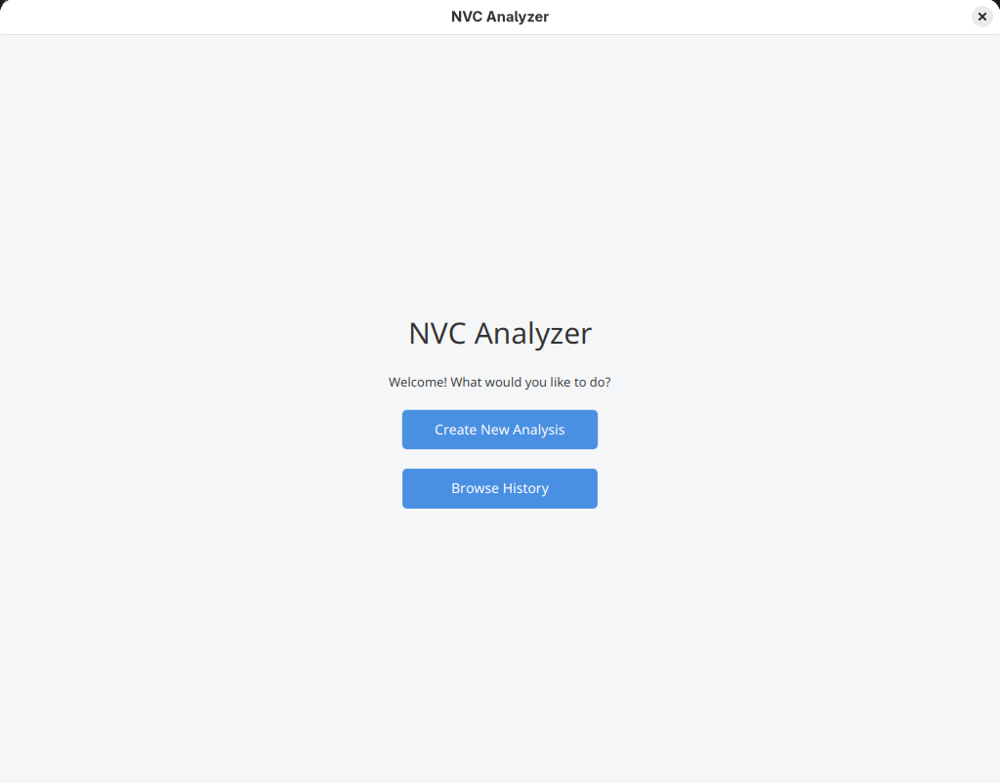
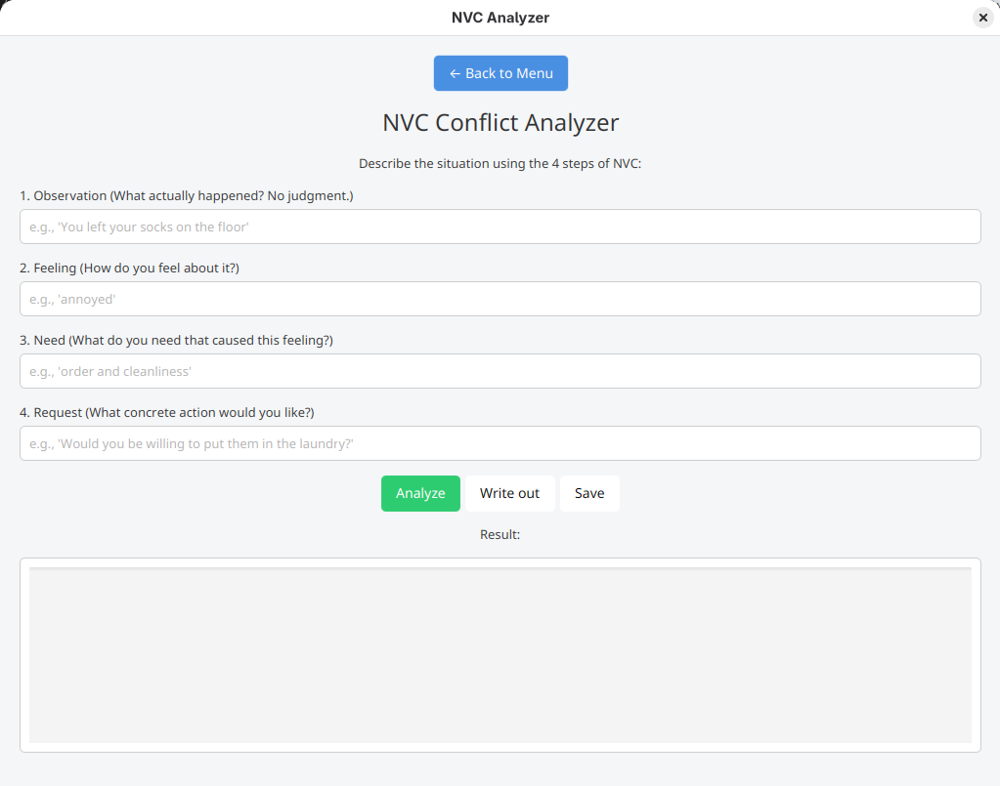
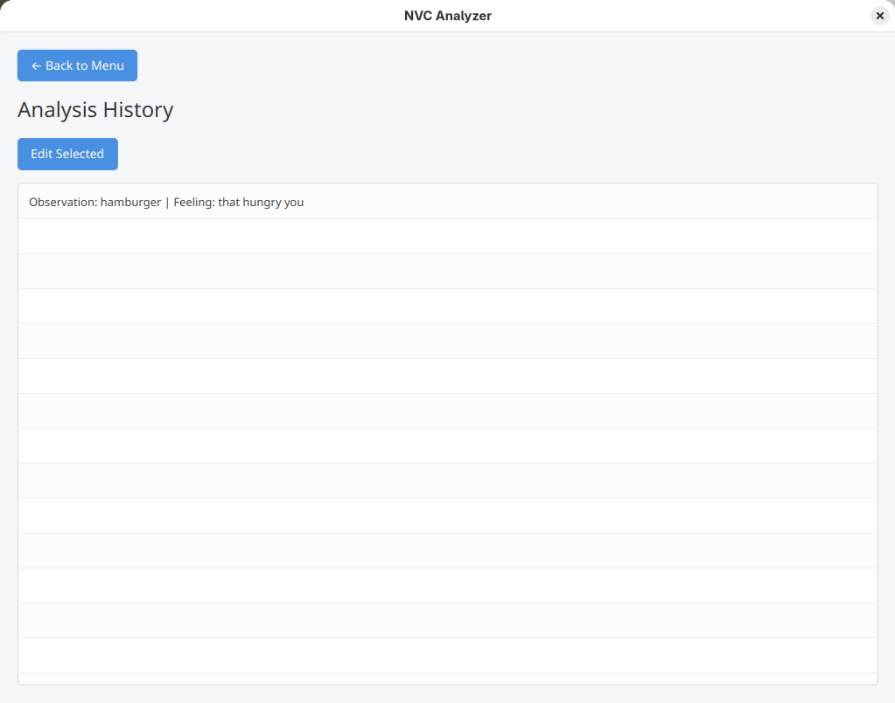
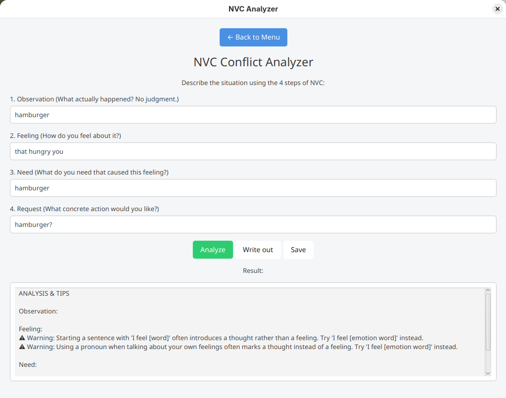
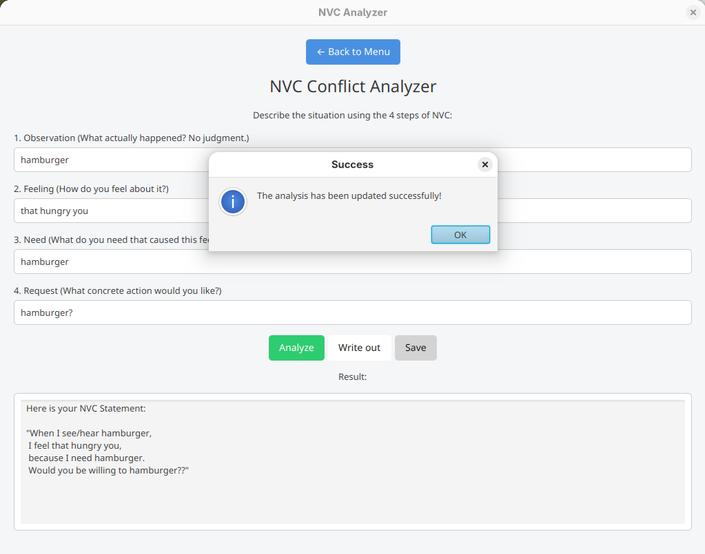

# NVC Analyzer

Have you ever faced a conflict where you weren't able to reach an understanding no matter what you said and did? If so, this application might prove itself to be just for you. It takes inspiration in the book "Non-Violent Communication: A Language of Life" by Marshall B. Rosenberg and tries to offer a new way to think about conflicts in terms of universal human needs and positive requests.

## Main Features

* Guided resolve of conflicts using NVC principles
* Analysis of input text based on regex patterns
* Saving of past conflicts with the ability to browse and edit them
* Concurrent execution of heavy instructions to prevent freezing

## Usage

1. Opening the application
    
    This is the menu. There are two buttons on it, `Create New Analysis` and `Browse History`. The will take us respectively to the analysis window (figure 2) or the history window (figure 3).

2. Creating new analysis
    
    This is the analysis window. There are 4 text fields for user input and 3 buttons for actions regarding that input (omitting the obvious `Back to Menu` button). All of those actions show a warning of some sort if any of the input fields are empty. These actions are discussed in greater detail later (point 4, 5 and 6).

3. Browsing history
    
    This is the history window. There is a list of past statements and a `Edit Selected` button. On clicking this button, the analysis window is opened with prefilled text fields. If no cell of the list has been selected, a warning is shown similar to pop-ups in figure 5 (in point 6).

4. Running analysis
    
    On clicking the `Analyze` button, the text from 4 input fields is processed by respective validators that look for specific words and phrases inside of the text that indicate different intentions.

5. Writing out the statement
    On clicking the `Write Out` button a statement is shown in the following form: 
    ```text
    "When I see/hear [observation],
    I feel [feeling],
    because I need [need].
    Would you be willing to [request]?"
    ```

6. Saving
    
    On clicking the `Save` button a pop-up in the form visible above is shown, indicating either missing info (any of the 4 input fields being empty) or a success. This is the only button that does not affect text shown in result area. 


## Technologies Used

* **Language:** Java 21
* **Framework:** JavaFX (GUI)
* **Build Tool:** Apache Maven
* **Data Manipulation:** Jackson
* **Testing:** JUnit 

## Requirements

Make sure to have these tools installed on your PC:

* **Java Development Kit (JDK):** Java version 21
* **Apache Maven:** Version 3.9

## Installation & Execution

1. **Clone the repository:**
    ```bash
   git clone https://github.com/kocarOnd/nvc-analyzer.git
   cd nvc-analyzer
   ```
2. **Compile the project:**
    ```bash
   mvn clean install
   ```
3. **Initialize the application:**
    ```bash
    mvn javafx:run
    ```
Note: After launching the project for the first time, only 3rd step is necessary to run the application.

## Project's Structure
```txt
src/
├── main/
│   ├── java/com/nvc/analyzer        # Java source code and controllers
│   └── resources/com/nvc/analyzer   # FXML files, CSS stylesheets and static JSON data
└── test/java/com/nvc/analyzer       # Unit tests
pom.xml                              # Configuration file of Maven
```